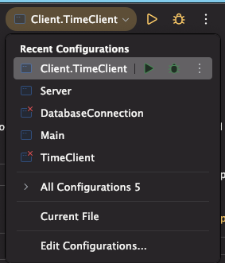
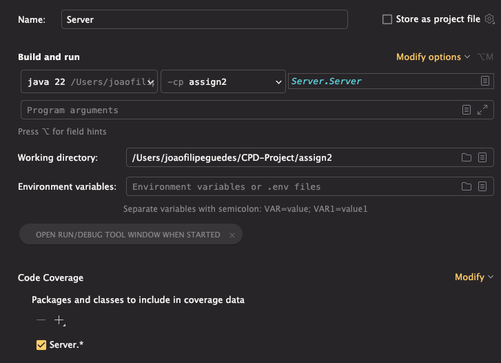
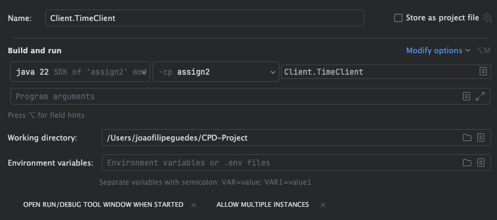
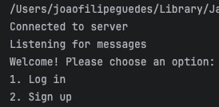
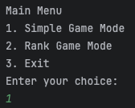

# Assignment 2

## Run the code

First you need to run the server. To do this select the recent Server configuration in the top right corner of the IDE and click on the play button. 

This will start the server.

Then you can run the client. To do you open a new terminal (you repeat this for every new client), then select the Client.TimeClient configuration in the top right corner of the IDE and click on the play button. This will start the client.

Then you are presented to a Menu where you can choose between the following options:
- Login
- Sign In

After that you can choose between the following options and play:
1. Simple Game (no rank)
2. Rank Game (rank)
3. Exit

